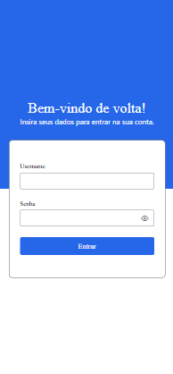
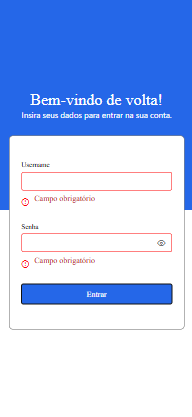
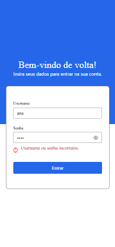
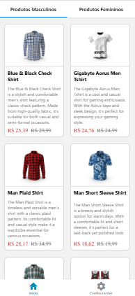
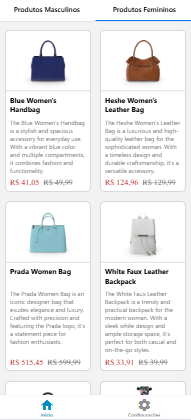
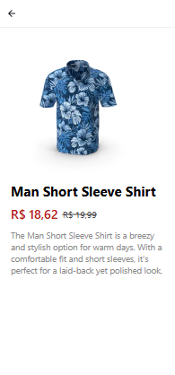
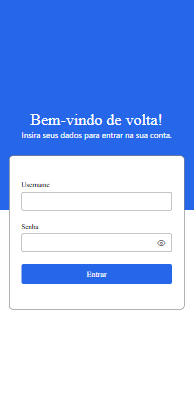

# 📱 Catálogo Interativo Mobile com Listagem de Produtos por Categoria

> Aplicativo mobile responsivo e leve desenvolvido em React Native com Expo para apresentar produtos de uma loja online organizados por categorias masculina e feminina. Consome uma API REST real via Axios, com navegação entre telas, exibição de detalhes e logout.

---

## 🧩 Desafio

Criar a primeira versão de um app mobile que lista produtos por categoria, permite navegar entre telas e consome uma API externa. O projeto deve aplicar boas práticas de React Native, tratamento de estados de carregamento e erros, e organização clara do código.

---

## ⚙️ Funcionalidades

- Tela de **Login** com validação simples e armazenamento temporário dos dados do usuário (useState ou Redux Toolkit)
- Tela de **Lista de Produtos** com abas por categorias:
  - Masculinas: camisetas, sapatos, relógios (mens-shirts, mens-shoes, mens-watches)
  - Femininas: bolsas, vestidos, joias, sapatos, relógios (womens-bags, womens-dresses, womens-jewellery, womens-shoes, womens-watches)
  - Consumo da API [DummyJSON](https://dummyjson.com/) via Axios
- Tela de **Detalhes do Produto** mostrando nome, imagem, descrição, preço e desconto
- Botão de **Logout** que limpa os dados e retorna à tela de login

---

## 📂 Estrutura de Pastas

```bash

catalogo-interativo-unifecaf
├── app/                   # Estrutura de navegação (Expo Router)
│   ├── (stacks)           # Telas em pilha (detalhes do produto)
│   ├── (tabs)             # Telas com navegação por abas
│   ├── configuration      # Configuração geral
│   ├── login              # Tela de login
│
├── src/
│   ├── assets/            # Imagens e arquivos estáticos
│   ├── components/        # Componentes reutilizáveis
│   ├── screens/           # Telas principais (home, detalhes, abas)
│   ├── services/          # Configuração e chamadas de API (Axios)
│   ├── store/             # Redux Toolkit (slices e store)
│   ├── utils/             # Funções utilitárias
│
├── app.json               # Configuração do Expo
├── package.json           # Dependências do projeto
└── README.md              # Documentação
```
- O app roda com:

  ```bash
  npx expo start

- Layout e navegação conforme [Figma](https://www.figma.com/design/Nbrwqt89RN9cvPYHDF08pu/Portfolio-Mobile-development)

## 🛠️ Tecnologias Utilizadas
- React Native + Expo

- Axios

- Redux Toolkit

- React Navigation (ou Expo Router)

- API pública: DummyJSON

- TypeScript

## 🚀 Como executar o projeto
1. Clone o repositório:

``` git clone https://github.com/Ingridxisto/Catalogo-Interativo-Mobile-API-DummyJSON.git ```

``` cd Catalogo-Interativo-Mobile-API-DummyJSON ```

2. Instale as dependências:

``` npm install ```

3. Inicie o Expo:

``` npx expo start ```

4. Abra o app em um emulador ou dispositivo via QR Code.

## 🖼️ Prints do Aplicativo

### Tela de Login


*Validação simples dos campos e armazenamento temporário do usuário.*


*Mensagem de campos obrigatórios.*


*Aviso para usuário ou senha incorretos.*

### Tela de Lista de Produtos com Abas por Categorias

#### Produtos Masculinos


#### Produtos Femininos


### Tela de Detalhes de Produto

#### Produto Masculino


#### Produto Feminino


### Tela de Configurações/Logout

#### Configurações


#### Tela de Logout


#### Logout com retorno para o login com os dados limpos 


#### PDF com prints das telas e breve explicação das funcionalidades


## Conclusão

Este projeto representa um exemplo prático e completo de desenvolvimento de um aplicativo móvel moderno utilizando React Native com Expo, integrando navegação fluida, gerenciamento eficiente de estado com Redux Toolkit e consumo dinâmico de dados via API externa.

Além de consolidar conceitos fundamentais de desenvolvimento mobile, o app oferece uma experiência intuitiva e responsiva para o usuário final, servindo como base robusta para projetos futuros e aprimoramentos.

Convido você a explorar o código, entender a arquitetura e contribuir para tornar este projeto ainda melhor!

